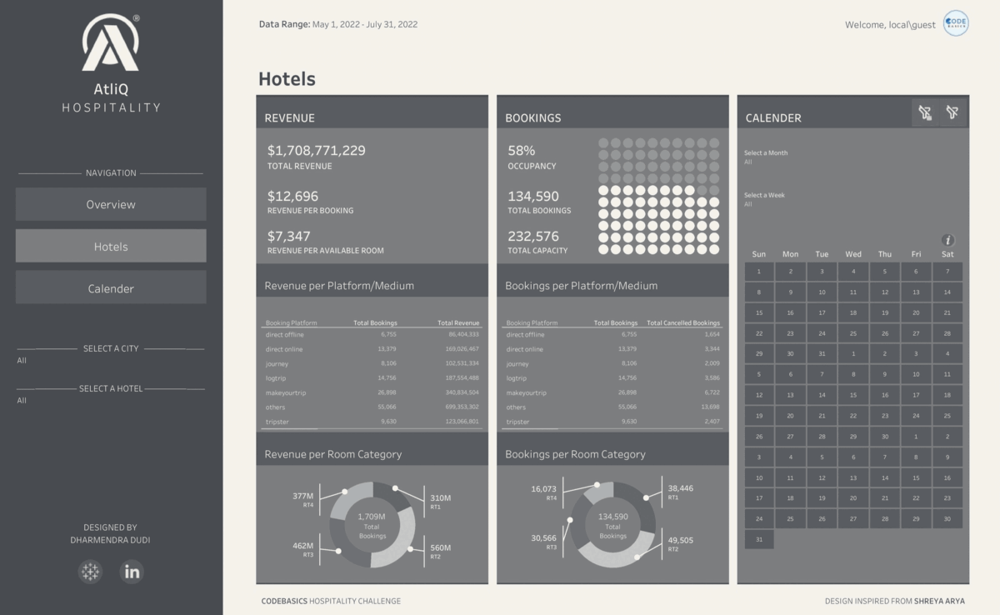

# CodeBasics - AtliQ Hospitality - Revenue & Bookings Analysis
**AtliQ** Grands owns multiple five-star hotels across India. They have been in the hospitality industry for the past 20 years. Due to strategic moves from other competitors 
and ineffective decision-making in management, AtliQ Grands are losing its market share and revenue in the luxury/business hotels category.

🌟 **Task**: As a data analyst, I have investigated the data to uncover insights related to revenue and bookings of the different hotels of AtliQ. To showcase the insights unearthed,
I have prepared a Tableau dashboard.

  
  &nbsp;&nbsp;&nbsp;
  

  

## Problem Statement
AtliQ Grands owns multiple five-star hotels across India. They have been in the hospitality industry for the past 20 years. Due to strategic moves from other competitors 
and ineffective decision-making in management, AtliQ Grands are losing its market share and revenue in the luxury/business hotels category. As a strategic move, the managing 
director of AtliQ Grands wanted to incorporate “Business and Data Intelligence” to regain their market share and revenue. However, they do not have an in-house data analytics 
team to provide them with these insights.

Their revenue management team had decided to hire a 3rd party service provider to provide them with insights from their historical data.

### Task List
You are a data analyst who has been provided with sample data and a mock-up dashboard to work on the following task. You can download all relevant documents from the download section.

- Create the metrics according to the metric list. 
- Create a dashboard according to the mock-up provided by stakeholders. 
- Create relevant insights that are not provided in the metric list/mock-up dashboard.

## Overview
🔹 Downloaded the data from the [codebasics resume project challenge](https://codebasics.io/challenge/codebasics-resume-project-challenge). Used MS-Excel to prepare the data and further connected with Tableau to analyze it.

🔹 To showcase the insights unearthed, I prepared a interactive tableau dashboard and also prepared a report to present the insights.

🔹 Implemented crucial hospitality domain metrics like RevPAR, ADR, DBRN, DSRN, and DURN. Also analyzed the historical data to uncover revenue-enhancing opportunities.

  
  &nbsp;&nbsp;&nbsp;
  

  

## Tableau Dashboard

  

## Business Recommendations
🔍 The revenue team should focus on the ways to increase the revenue per booking to ultimately increase total revenue. The team can setup dynamic pricing to significantly increase the revenue per booking.

🔍 Ratings given by customers can be improved by good service, cleanliness, good quality food, etc as it can hugely impact number of bookings.

🔍 The management team can setup dynamic pricing of rooms based on the occupancy level to increase the bookings of the hotels with lower occupancy %.

🔍 Since, the AtliQ Seasons is newly introduced, the marketing team should focus on advertising to increase the bookings of this particular franchise, by running special events or discounts on weekends, etc.

## Things learnt from this project

🔹 Hospitality domain related important metrics

🔹 Waffle, calender, and image fill charts in Tableau

🔹 Clear filters button in Tableau

🔹 Using dynamic zone visibility to switch sheets in Tableau

🔹 Using parameters to switch measures in Tableau

🔹 Boolean operations in Figma
